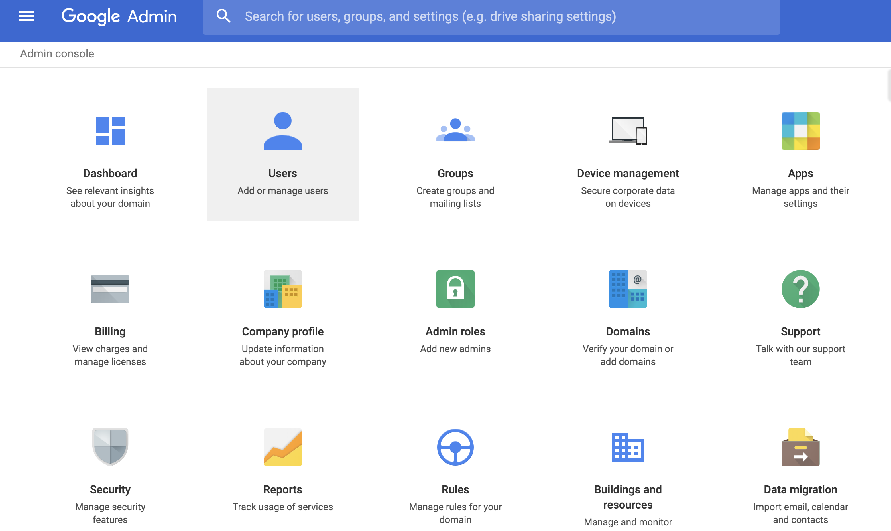
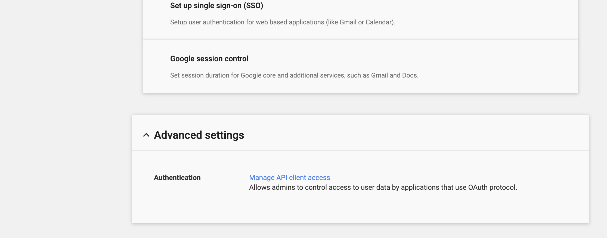
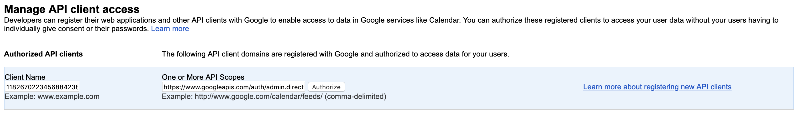

# gcp-assessment-setup
Give ScaleSec limited access to your GCP organization for a security assessment.

`scalesec-security-assessment@scalesec-dev.iam.gserviceaccount.com` will be added with minimal privliges into your GCP organization.

## Prerequisites
The following items are required for a successful setup.

- You must be an [Organization Role Admin](https://console.cloud.google.com/iam-admin/roles/details/roles<iam.organizationRoleAdmin)
- The [gcloud](https://cloud.google.com/sdk/) SDK CLI
- The `jq` CLI utility for your chosen platform

## Setup instructions

1. Open your Google Cloud [console](https://console.cloud.google.com).
2. Open Cloud Shell


3. Clone this repositry and switch to its directory:

```
git clone https://github.com/ScaleSec/gcp-assessment-setup.git
cd gcp-assessment-setup/
```

4. Edit the `manage_security_assessment_role.sh` and set the organization name:

```
ORG_NAME="example.com"
```

_Note: other variables including the `ROLE_ID`, `YAML_PATH`, and `SERVICE_ACCOUNT` should not be changed._ 


5. Run the script to set permissions:

```
bash manage_security_assessment_role.sh create
```

6. Run the script to enable APIs:

```
bash enable_service_apis.sh
```

## From the Admin Console (https://admin.google.com):

The Service Account is required to have permission to impersonate a Super Admin in order to test if all users have MFA enabled.  This Service Account will have minimal permission scopes as laid out in Step 9.

Google Documentation around this subject is located [here](https://developers.google.com/admin-sdk/directory/v1/guides/delegation).  The Customer will also need to provide the email address of the Super Admin to impersonate.

7. Sign into the [Admin Console](https://admin.google.com) with a `Super User` Account:

<p align="center">
    
</p>

8. Select Security --> Advanced Settings --> Manage API Client Access

<p align="center">
    
</p>

9. Input `101372154367894419728` into the `Client Name` Field.  Add `https://www.googleapis.com/auth/admin.directory.user.readonly,https://www.googleapis.com/auth/admin.directory.domain.readonly`to the API Scopes Field

<p align="center">
    
</p>